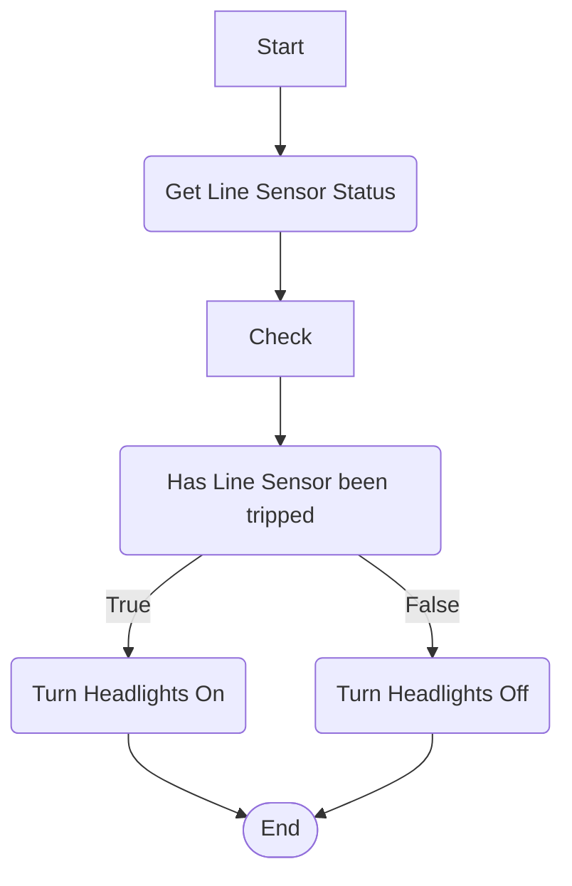

# Programming Logic

## Car Headlights

```mermaid
flowchart TD
    getLineSensorStatus(Get Line Sensor Status)
    ifcheckLineSensor(Has Line Sensor been tripped)
    turnHeadLightsOn(Turn Headlights On)
    turnHeadLightsOff(Turn Headlights Off)
    finish([End])

    Start -->
    getLineSensorStatus -->
    Check -->
    ifcheckLineSensor --> |True| turnHeadLightsOn
    ifcheckLineSensor --> |False| turnHeadLightsOff
    turnHeadLightsOn --> finish
    turnHeadLightsOff --> finish

```
