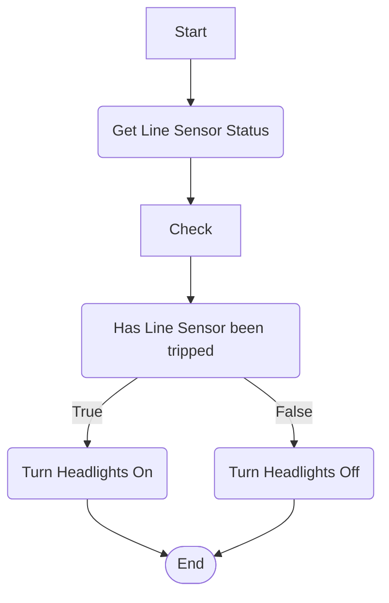
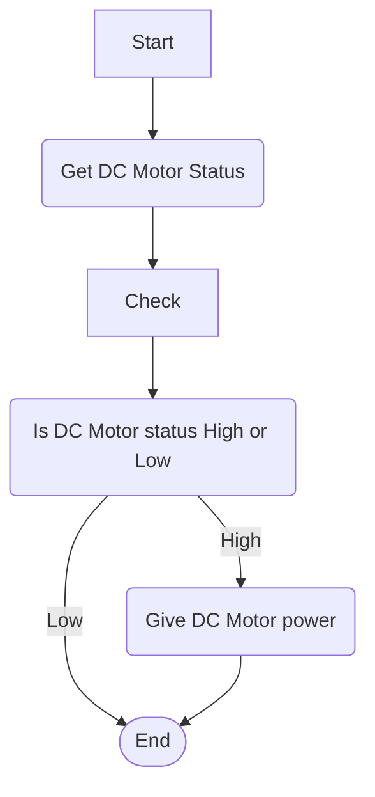
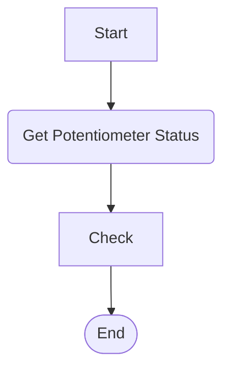
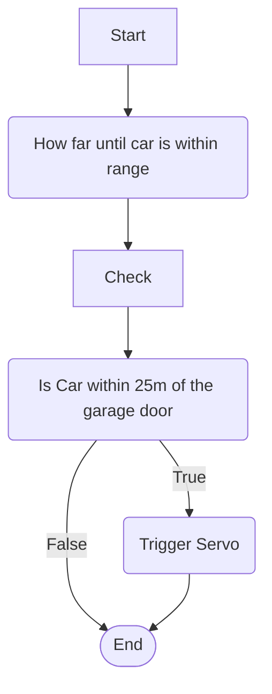
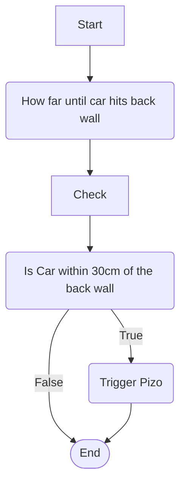
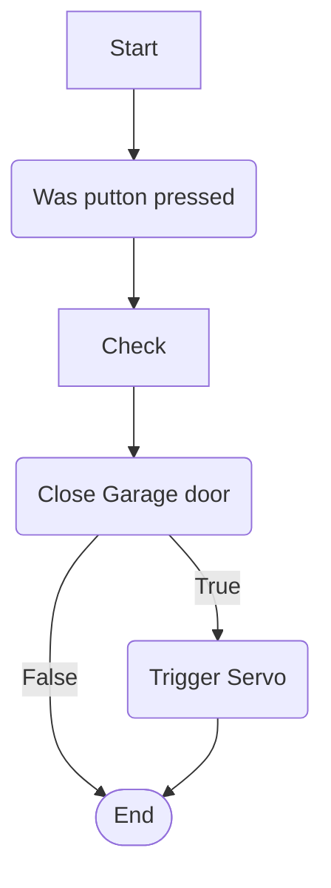

# Programming Logic

## Car Headlights

```mermaid
flowchart TD
    getLineSensorStatus(Get Line Sensor Status)
    ifcheckLineSensor(Has Line Sensor been tripped)
    turnHeadLightsOn(Turn Headlights On)
    turnHeadLightsOff(Turn Headlights Off)
    finish([End])

    Start -->
    getLineSensorStatus -->
    Check -->
    ifcheckLineSensor --> |True| turnHeadLightsOn
    ifcheckLineSensor --> |False| turnHeadLightsOff
    turnHeadLightsOn --> finish
    turnHeadLightsOff --> finish

```
## Car Motor

```mermaid
flowchart TD
    getDCMotorStatus(Get DC Motor Status)
    ifDCMotorStatus(Is DC Motor status High or Low)
    ifDCMotorStatusHigh(Give DC Motor power)
    finish([End])

    Start -->
    getDCMotorStatus -->
    Check -->
    ifDCMotorStatus --> |High| ifDCMotorStatusHigh
    ifDCMotorStatus --> |Low| finish
    ifDCMotorStatusHigh --> finish
```
## Speed Control

```mermaid
flowchart TD
    getpotentiometerStatus(Get Potentiometer Status)
    finish([End])

    Start -->
    getpotentiometerStatus -->
    Check -->
    
    finish
```
## Garage Door

```mermaid
flowchart TD
    getGPSStatus(How far until car is within range)
    ifGPSStatus(Is Car within 25m of the garage door)
    ifGPSStatusIsTrue(Trigger Servo)
    finish([End])

    Start -->
    getGPSStatus -->
    Check -->
    ifGPSStatus --> |True| ifGPSStatusIsTrue
    ifGPSStatus --> |False| finish
    ifGPSStatusIsTrue --> finish
```

## Warning Alarm

```mermaid
flowchart TD
    getSonarStatus(How far until car hits back wall)
    ifSonarStatus(Is Car within 30cm of the back wall)
    ifSonarStatusTrue(Trigger Pizo)
    finish([End])

    Start -->
    getSonarStatus -->
    Check -->
    ifSonarStatus --> |True| ifSonarStatusTrue
    ifSonarStatus --> |False| finish
    ifSonarStatusTrue --> finish
```

## Close Garage Door

```mermaid
flowchart TD
    getCrashSensorStatus(Was putton pressed)
    ifCrashSensorStatus(Close Garage door)
    ifSonarStatusTrue(Trigger Servo)
    finish([End])

    Start -->
    getCrashSensorStatus -->
    Check -->
    ifCrashSensorStatus --> |True| ifSonarStatusTrue
    ifCrashSensorStatus --> |False| finish
    ifSonarStatusTrue --> finish
```