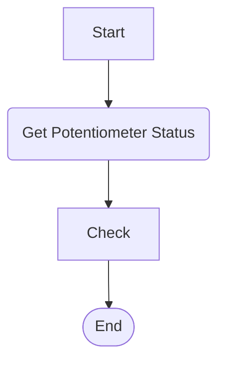

# Programming Logic

## Car Motor

```mermaid
flowchart TD
    getpotentiometerStatus(Get Potentiometer Status)
    finish([End])

    Start -->
    getpotentiometerStatus -->
    Check -->
    
    finish
```
